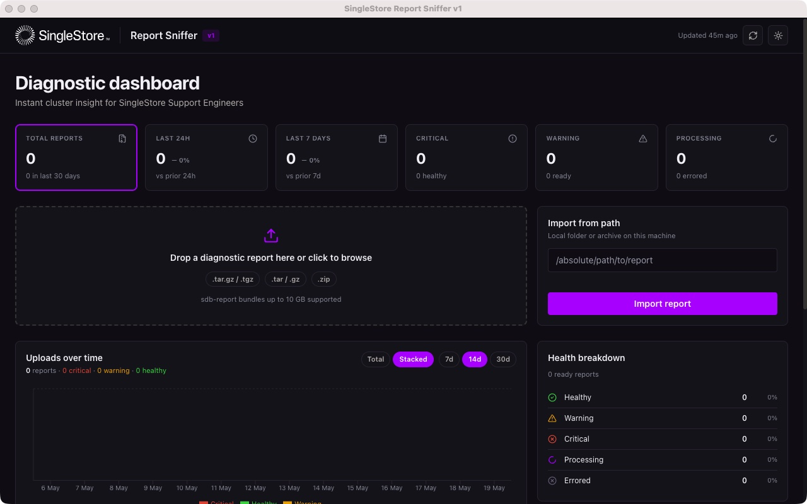

<h1 align="center">
  
</h1>

<p align="center">
  
  
  
  
  
</p>

<p align="center">
  <strong>🕵️ Offline Diagnostic Intelligence for SingleStore Clusters</strong>
</p>

---

## ⚡ Why This Exists

When troubleshooting distributed databases in **air-gapped** or high-security environments, support engineers rely on massive diagnostic bundles (`sdb-report`). These contain gigabytes of unstructured logs, OS metrics, and hardware telemetry across dozens of nodes.

**Manual `grep`-based triage is slow and error-prone.** S2 Report Sniffer automates this:

| Capability | What It Does |
|-----------|-------------|
| 📥 **Streaming Ingestion** | Parse 10GB+ archives without OOM crashes |
| 🔗 **Correlation** | Stitch together `memsql.log`, `dmesg`, OS metrics |
| 🎯 **SuperChecker** | Score findings by operational risk |
| 🤖 **Glean Integration** | Query enterprise knowledge bases |

---

## 🏗️ Architecture

```
┌─────────────────────────────────────────────────────────────┐
│                    S2 Report Sniffer                        │
├─────────────────────────────────────────────────────────────┤
│  ┌──────────────┐   ┌──────────────┐   ┌──────────────┐  │
│  │   Electron   │◀──│   FastAPI    │◀──│   Parsers    │  │
│  │  Desktop UI  │   │   Backend    │   │   Engine     │  │
│  └──────────────┘   └──────────────┘   └──────────────┘  │
│         │                  │                   │            │
│         ▼                  ▼                   ▼            │
│  ┌──────────────┐   ┌──────────────┐   ┌──────────────┐  │
│  │   SQLite     │   │  Diagnostic  │   │  SuperChecker│  │
│  │  (Local DB)  │   │   Bundles    │   │   Scoring    │  │
│  └──────────────┘   └──────────────┘   └──────────────┘  │
└─────────────────────────────────────────────────────────────┘
```

---

## 🎯 Key Features

### Diagnostic Capabilities
- **Log Timeframe Detection** — Exact telemetry coverage per node
- **Backup Reliability** — Silent failures, duration drift detection
- **Hardware Pressure** — IOPS stalls, network drops, memory pressure
- **Topology Sanity** — Partition distribution validation
- **Process Health** — Active queries & sleeping transactions

### Engineering Highlights
- 🔒 **Local-First** — Zero data leaves your machine
- 💾 **Bounded Memory** — Fixed footprint with generators
- 🎯 **Risk Scoring** — Prioritized "Fix-First" dashboard
- 🤖 **AI-Powered** — Glean integration for context search

---

## 🚀 Getting Started

### Prerequisites
- Python 3.9+
- Node.js 18+

### Backend Setup
```bash
cd backend
python -m venv .venv
source .venv/bin/activate
pip install -r requirements.txt
uvicorn server:app --host 127.0.0.1 --port 8000 --reload
```

### Frontend Setup
```bash
cd frontend
npm install
npm run dev
```

### Desktop Build
```bash
./dev-setup.sh build:mac
```

---

## 📋 How to Use

### Step 1 — Launch the App

Open **S2 Report Sniffer** from your Applications folder. The Electron app starts automatically:

```
Applications/
└── S2 Report Sniffer.app       ← macOS desktop app (recommended)
```

On first launch, the backend starts on `127.0.0.1:8000` and the UI opens in a window.

> **Tip:** You can also run the web UI at `http://localhost:3000` while developing, or `http://localhost:8000` when using the built production UI.

### Step 2 — Upload a Diagnostic Bundle

The home screen shows the **Diagnostic Dashboard**:



1. **Drag and drop** a SingleStore diagnostic archive (`.zip`, `.tar.gz`, `.tgz`, `.tar`, or `.gz`) onto the upload zone, **or** click it to browse
2. **Import from path** — enter a local folder or archive path if the file is already on your machine
3. Click **Import report** to begin processing

Accepted formats: `.zip`, `.tar.gz`, `.tgz`, `.tar`, `.gz` — up to **10 GB**

> **Why upload fails:** If you see "invalid format" or "unable to extract," verify the archive was created with `sdb-report collect`. Raw SingleStore log folders won't work — they must be packaged.

### Step 3 — Wait for Analysis

Reports move through three states:

| Status | Meaning |
|--------|---------|
| `uploading` | File is transferring |
| `processing` | Extracting, parsing logs, running SuperChecker |
| `ready` | Analysis complete — view the report |
| `errored` | Extraction failed — see troubleshooting below |

Processing time depends on bundle size. A 1 GB bundle typically takes 30–90 seconds.

### Step 4 — Explore the Report Dashboard

Click any **ready** report to open its dashboard. The report dashboard has four main views:

#### Cluster Overview
High-level cluster health at a glance — node list, partition counts, backup status, detected log patterns, and dmesg events.

#### Recommendations
Ranked findings from the SuperChecker engine, sorted by risk score. Click any row to expand the full finding with severity, description, evidence, and remediation steps.

| Column | What it shows |
|--------|-------------|
| Severity | `critical` / `warning` / `info` |
| Checker ID | Which SingleStore `sdb-report check` generated this |
| Title | Short description of the issue |
| Risk Score | 0–1000 composite score |
| Nodes | Which hosts are affected |

Filter by severity, category, or search by keyword. Export all findings as JSON.

#### Node Health & Capacity
Per-node memory usage, disk utilization, partition counts, and OS metrics (swap, cgroup, THP) for each node in the cluster.

#### Config Health
License validity, engine variables, authentication settings, SSL/TLS configuration, and security recommendations.

### Step 5 — Understand the Health Score

The health score (0–100) is computed by the SuperChecker engine:

| Grade | Score | Meaning |
|-------|-------|---------|
| **A** | 90–100 | Cluster is healthy — no action required |
| **B** | 80–89 | Minor issues present — monitor closely |
| **C** | 70–79 | Moderate risk — review recommendations |
| **D** | 60–69 | Elevated risk — schedule investigation |
| **F** | 0–59 | Critical — immediate action required |

### Keyboard Shortcuts

| Shortcut | Action |
|----------|--------|
| `⌘R` | Refresh reports list |
| `⌘O` | Open file browser to select archive |
| `⌘⌥I` | Open DevTools (development builds) |

---

## 🔧 Troubleshooting

### App Won't Open / Window is Blank

**Symptom:** The app launches but shows a white or empty window.

**Solution:**
1. Quit the app (`⌘Q`)
2. Open **Activity Monitor** and terminate any lingering `S2 Report Sniffer` processes
3. Restart the app from Applications

If it persists, check that port **8000** is not in use by another service:
```bash
lsof -i :8000
```

### Upload Fails with "Unable to Extract"

**Symptom:** The report shows `errored` status immediately after upload.

**Likely causes:**
1. The file is not a valid SingleStore diagnostic bundle
2. The archive is corrupted or partially downloaded
3. The bundle was created with an older `sdb-report` version

**Solution:**
- Re-download the original bundle from the SingleStore Toolbox or support portal
- Verify the file integrity: `file your-report.zip` should return `Zip archive` or `gzip compressed data`
- If the file was collected on SingleStore DB version < 7.5, some parser signals may be absent

### Report Stays in "Processing" State

**Symptom:** A report has been `processing` for more than 5 minutes.

**Solution:**
1. Check backend logs in the terminal that started the app
2. Look for `MemoryError`, `DecompressionBombError`, or `tarfile.ReadError`
3. If the bundle is > 5 GB, consider splitting it using `sdb-report collect` with a node filter

### "No Data Available" in Node Health or Config Health

**Symptom:** Screens show empty data despite the report being `ready`.

**Cause:** The diagnostic bundle was collected without the `--include-infra` flag or on a single-node cluster without full OS telemetry collected.

**Solution:**
- Request a fresh bundle: `sdb-report collect --validate-env --include-infra`
- Single-node evaluation bundles may not include all signals

### Backend Errors on Startup

**Symptom:** App window shows "Backend unavailable" or the terminal shows tracebacks.

**Solution:**
```bash
cd backend
source .venv/bin/activate
uvicorn server:app --host 127.0.0.1 --port 8000 --reload
```
Watch the output for:
- `ModuleNotFoundError` → run `pip install -r requirements.txt`
- `PermissionError` on `.local_data/` → `chmod 755 .local_data/`
- `Database is locked` → close other instances and retry

### Dark Mode Not Applying

**Symptom:** The light/dark toggle works but some elements (badges, borders) don't update.

**Cause:** Some inline CSS still uses hardcoded hex values instead of CSS variables.

**Solution:** This is a known limitation — affected elements are purely cosmetic and don't impact analysis accuracy. A fix is tracked in the project backlog.

### Report List is Empty After Upload

**Symptom:** Upload completes successfully but the report doesn't appear in the list.

**Solution:**
1. Click **Refresh reports** (top right)
2. Check that the backend is running on port 8000
3. If the backend recently restarted, the in-memory upload queue may have been lost — re-upload the bundle

### Performance Issues with Large Bundles

**Symptom:** The app becomes slow or unresponsive when processing large (> 2 GB) bundles.

**Solution:**
- Processing is CPU-bound — close other heavy applications
- For bundles > 5 GB, use the CLI parser directly:
```bash
cd backend && source .venv/bin/activate
python -c "
from parsers import parse_report_archive_streaming
import sys
for node in parse_report_archive_streaming('/path/to/bundle.tar.gz'):
    print(node.get('hostname'), node.get('version'))
"
```

---

## 📦 Supported Formats

| Format | Extension |
|--------|-----------|
| Tarball | `.tar.gz`, `.tgz` |
| ZIP | `.zip` |
| Single File | `.tar`, `.gz` |

**Max Size:** 10 GB

---

## 🔒 Security

This tool processes sensitive database telemetry. It's architected for **offline operation**:

- ❌ No telemetry leaves your local machine
- ❌ No remote crash reporting
- ✅ Secrets encrypted in local SQLite

---

<p align="center">
  
</p>

<div align="center">
  Built for Database Reliability Engineering & Advanced Support Operations 🔧
</div>
